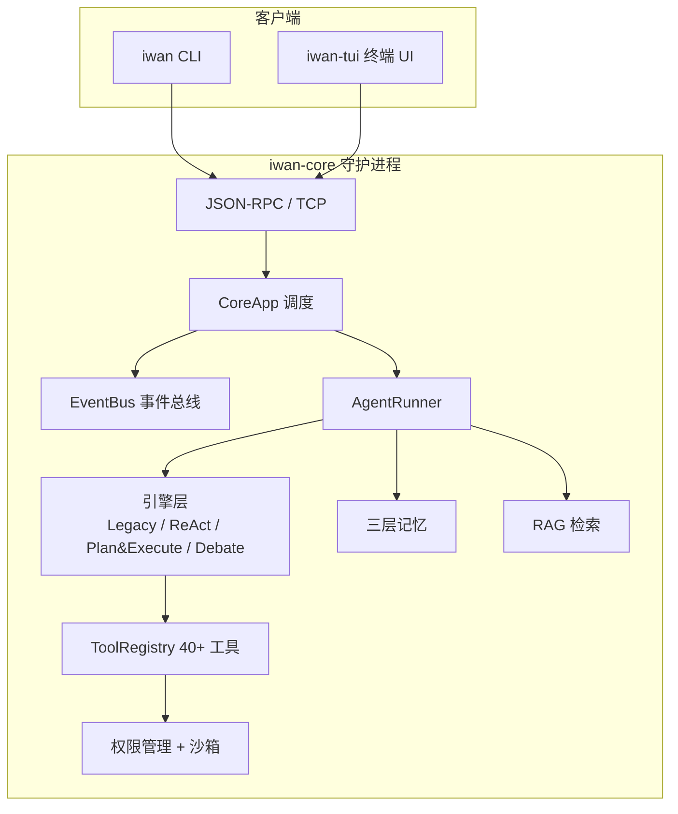

# IwanClaude


**本地优先的 AI Agent 系统** —— 4 种可切换执行引擎、三层记忆、RAG 检索、安全沙箱、多智能体并行，全部跑在你自己的机器上。

`iwan-core` 作为常驻守护进程处理所有任务，`iwan`（CLI）和 `iwan-tui`（TUI）通过 TCP loopback 与之通信。

---

## ✨ 特性矩阵

| 模块 | 能力 |
|------|------|
| **Agent 引擎** | 4 模式可切换：Legacy / ReAct / Plan&Execute / Debate(worker-critic) |
| **三层记忆** | 长期记忆(JSONL) + 向量记忆(embedding) + 统一检索 Manager |
| **RAG** | 6 种分块策略 + 语义+关键词混合检索 + 增量索引 + 查询重写 |
| **安全沙箱** | 文件系统沙箱 + 6 级权限优先级 + auto_mode 状态机 |
| **双进程 IPC** | JSON-RPC over TCP + 事件广播器 |
| **子 Agent** | 并行 Spawn + 信号量限流 + 后台任务注册表 |
| **上下文管理** | compact 压缩 + LangGraph checkpoint 检查点恢复 |
| **TUI** | 多会话 Tab + Token 级流式渲染 + 内联权限 UI + 斜杠命令 |
| **Skills** | 项目级 > 用户级 > 内置 三级优先加载 |
| **MCP** | 外部工具服务器协议（stdio/tcp） |

---

## 🏗️ 架构图



---

## 🤖 Agent 引擎对比

通过环境变量 `IWAN_AGENT_ENGINE` 一键切换，4 种引擎共享相同的工具/权限/记忆基础设施：

| 引擎 | 模式 | 工作流 | 适用场景 |
|------|------|--------|----------|
| `legacy` | 简单循环 | chat → tools → chat ... | 快速任务 |
| `langgraph` | ReAct | 边想边做循环 | 探索性任务 |
| `plan_execute` | Plan & Execute | plan → execute → reflect | 复杂多步骤 |
| `debate` | Worker-Critic | worker 回答 → critic 评判 → 改进 | 质量敏感任务 |

**Debate 引擎**采用 worker-critic 多智能体辩论：worker 回答问题（可调用工具），独立的 critic agent 评判答案质量，不满意则 worker 改进，最多 3 轮。对标学术界 Multi-Agent Debate / LLM-as-a-Judge 方向。

---

## 🚀 快速开始

### 环境要求

| 依赖 | 版本 |
|------|------|
| 操作系统 | macOS / Linux / Windows |
| Python | 3.12.x |
| [uv](https://docs.astral.sh/uv/) | ≥ 0.4 |

安装 uv（若尚未安装）：

```bash
# macOS / Linux
curl -LsSf https://astral.sh/uv/install.sh | sh
# Windows (PowerShell)
powershell -ExecutionPolicy ByPass -c "irm https://astral.sh/uv/install.ps1 | iex"
```

Python 3.12 由 uv 自动管理，无需手动安装。

### 安装与启动

```bash
git clone <repo> && cd IwanClaude
uv sync
cp .env.example .env        # 填入你的 API Key

uv run iwan-core            # 启动守护进程
uv run iwan ping            # 验证连通：应返回 pong
uv run iwan-tui             # 启动终端 UI
```

### 切换 Agent 引擎

```bash
# 使用 Debate 引擎（worker-critic 辩论）
IWAN_AGENT_ENGINE=debate uv run iwan-core

# 使用 Plan & Execute 引擎（先规划再执行）
IWAN_AGENT_ENGINE=plan_execute uv run iwan-core

# 使用 ReAct 引擎（边想边做）
IWAN_AGENT_ENGINE=langgraph uv run iwan-core
```

> Windows PowerShell 下使用 `$env:IWAN_AGENT_ENGINE="debate"; uv run iwan-core`

---

## 📸 演示截图

> 截图待补充，以下为计划展示内容：

| 场景 | 说明 |
|------|------|
| 多会话 Tab + 流式输出 | TUI 多会话切换、Token 级流式渲染 |
| Debate 辩论过程 | worker 回答 → critic 评判 → 改进的完整辩论 |
| 内联权限审批 | 工具调用触发权限审批的内联 UI |

---

## 📚 文档

- **[RUNBOOK.md](./RUNBOOK.md)** — 完整操作参考：配置、开发命令、故障排查
- **[WIRE_PROTOCOL.md](./WIRE_PROTOCOL.md)** — IPC 协议定义（由代码生成，勿手动编辑）
- **[docs/](./docs/)** — 架构笔记、记忆集成记录、项目展示清单

---

## 🧪 测试

```bash
uv run python -m pytest tests/unit/ -q
```

当前 51 个测试文件、570+ 个测试用例覆盖核心模块：引擎逻辑、工具调用、权限管理、RAG 检索、会话管理、IPC 通信、沙箱安全等。
