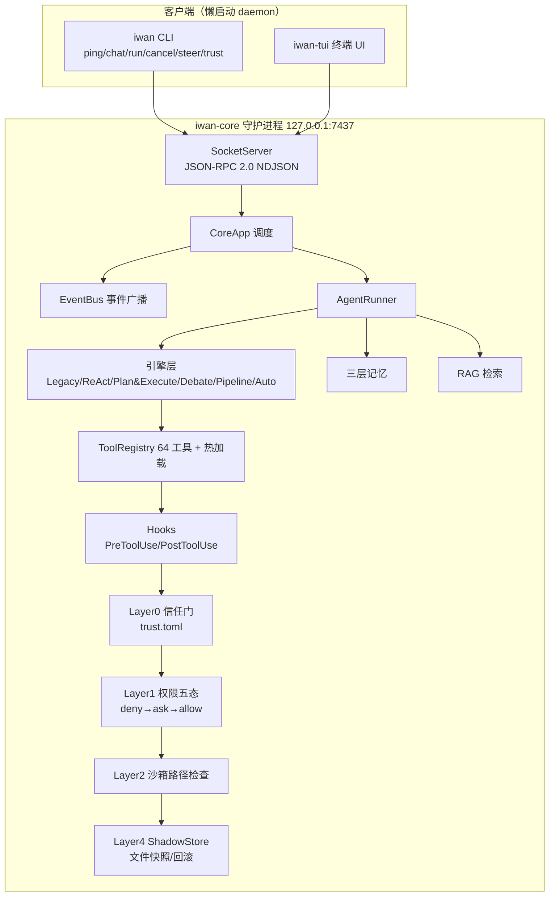

# IwanClaude


**Windows 优先的本地 AI Agent 系统** —— 6 种可切换执行引擎、五层安全防御、文件级回滚、三层记忆、RAG 检索、多智能体并行，全部跑在你自己的机器上。

`iwan-core` 是常驻守护进程（JSON-RPC 2.0 over TCP loopback），`iwan`（CLI）与 `iwan-tui`（终端 UI）是它的两个客户端。守护进程**懒启动**：任意客户端命令发现 core 未运行时会自动拉起，无需手动 `core start`。

> **平台声明**：本项目以 **Windows 原生环境为主要开发与目标平台**（Job Object 进程树管控、路径规范化、PowerShell 命令均为 Windows 优先设计）；macOS / Linux 可运行但非首发验证目标。

---

## ✨ 特性矩阵

| 模块 | 能力 |
|------|------|
| **Agent 引擎** | 6 模式可切换：Legacy / ReAct / Plan&Execute / Debate / Pipeline / **Auto**（按任务自动路由），TUI 运行时 `/engine` 动态切换 |
| **五层安全防御** | Layer0 项目信任门 → Layer1 权限系统（deny→ask→allow + 五态模式）→ Layer2 沙箱路径检查 → Layer4 审计 + 文件快照回滚（Layer3 OS 级强制已设计、暂缓） |
| **Hooks 体系** | PreToolUse/PostToolUse 钩子，exit 2 强制阻断，任何权限模式（含 bypassPermissions）跳不过 |
| **文件回滚** | ShadowStore 内容寻址快照：F7 面板勾选还原 / `/files` 命令 / CLI 三入口，还原本身也可再撤销 |
| **运行控制** | `run.cancel` 取消运行中任务 + `run.steer` 运行中追加修正指令，不用等跑完 |
| **三层记忆** | 长期记忆(JSONL) + 向量记忆(embedding) + 统一检索 Manager，AGENTS.md/CLAUDE.md 指令加载 |
| **RAG** | 6 种分块策略 + 语义/关键词混合检索 + 增量索引 + 查询重写 + 自适应策略 |
| **双进程 IPC** | JSON-RPC 2.0 NDJSON over TCP，pydantic 判别式模型定义协议，文档由代码生成 |
| **子 Agent** | 并行 Spawn + 信号量限流 + Windows Job Object 进程树击杀 |
| **TUI** | 多会话 Tab + Token 级流式 + 内联权限审批 + 信任对话框 + 检查点(F6) + 文件变更面板(F7) + 命令面板(Ctrl+P) |
| **工具系统** | 64 个内置工具 + 热加载（放 `.py` 进 `.iwan/tools/` 即发现，运行时 reload）+ 并行调用 |
| **MCP** | 外部工具服务器协议（stdio / tcp） |
| **Skills** | 项目级 > 用户级 > 内置三级技能加载，自动触发 + 手动 `/skill_name` |

---

## 🏗️ 架构



---

## 🔒 安全模型（对标 Claude Code）

防御链分层，**先匹配先赢，宽 deny 永不可被窄 allow 例外**：

| 层 | 机制 | 要点 |
|---|------|------|
| **Layer 0** | 项目信任门 | 首次进入目录问一次"允许 iwan 在这里工作吗"，持久化到 `~/.iwan/trust.toml`，可撤销；deny 目录连 bypassPermissions 都绕不过写/执行工具 |
| **Layer 1** | 权限系统 | 规则序 deny → ask → allow；五态模式（default / acceptEdits / plan / auto / bypassPermissions）只放宽默认档，不穿透 deny 地板与强制 ask |
| **Hooks** | 强制前置闸 | PreToolUse 在任何权限评估前触发，exit 2 = 硬阻断并把 stderr 回灌给模型；**用户不可见层，bypass 也跳不过** |
| **Layer 2** | 沙箱路径检查 | resolve 判界 + symlink 防逃逸 + bash 命令路径扫描 |
| **Layer 4** | 审计 + 快照 | 全工具审计日志；写文件前自动快照，改坏了 F7 一键还原 |
| Layer 3 | OS 级强制 | RestrictedToken + NTFS DACL 设计已定稿（见 S9 计划书），评估后暂缓——与 Claude Code 官方 Windows 现状一致 |

default-ask 原则：未匹配任何规则的敏感操作默认弹问，而非默认放行。

---

## 🤖 Agent 引擎

5 种执行引擎 + 1 种自动路由，共享同一套工具/权限/记忆基础设施：

| 引擎 | 模式 | 工作流 | 适用场景 |
|------|------|--------|----------|
| `legacy` | 简单循环 | chat → tools → chat ... | 快速任务 |
| `langgraph` | ReAct | 边想边做 + 反思 | 探索性任务 |
| `plan_execute` | Plan & Execute | plan → execute → reflect | 复杂多步骤 |
| `debate` | Worker-Critic | worker 回答 → critic 评判 → 改进 | 质量敏感任务 |
| `pipeline` | Planner-Executor-Reviewer | plan → execute → review → 返工 | 多角色分工交付 |
| `auto` | 自动路由 | 按任务特征选择上述引擎 | 不想操心选引擎时 |

**Debate** 对标学术界 Multi-Agent Debate / LLM-as-a-Judge：worker 与 critic 双智能体，最多 3 轮，动态退出。**Pipeline** 强调职责分离：规划、执行、审查由不同 prompt 的角色承担，Reviewer 裁决 approved/needs_rework。

---

## 🚀 快速开始

### 环境要求

| 依赖 | 版本 | 说明 |
|------|------|------|
| 操作系统 | **Windows 10/11**（主要目标） | macOS / Linux 可运行，非首发验证 |
| Python | 3.12.x | 由 uv 自动管理，无需手动安装 |
| [uv](https://docs.astral.sh/uv/) | ≥ 0.4 | |

```powershell
# Windows PowerShell 安装 uv
powershell -ExecutionPolicy ByPass -c "irm https://astral.sh/uv/install.ps1 | iex"
```

### 安装与启动

```powershell
git clone https://github.com/longer1225/IwanClaude.git
cd IwanClaude
git checkout feature/iwanclaude-windows
uv sync
cp .env.example .env        # 填入你的 API Key

uv run iwan-tui             # 启动 TUI（daemon 懒启动，自动拉起）
```

守护进程也可显式管理：`uv run iwan core start` / `core status` / `core stop`。

### 常用操作

```powershell
uv run iwan ping            # 验证连通：返回 pong
uv run iwan chat            # CLI 多轮对话（调试用；产品界面是 TUI）
uv run iwan trust list      # 查看项目信任条目
```

TUI 内：

```text
/engine pipeline        # 运行时切换引擎（下次对话生效）
/effort high            # 努力等级：影响推理深度与工具预算
/model powerful         # 模型预设：fast / balanced / powerful
Shift+Tab               # 循环五态权限模式
F6                      # 检查点列表/恢复（对话回溯）
F7                      # 文件变更面板（勾选 → r 还原 / f 强制还原）
/files                  # 同 F7，斜杠命令入口
Ctrl+P                  # Textual 命令面板
```

---

## 🧪 测试与质量

```powershell
uv run python -m pytest tests/unit -q          # 990+ 单测，无需 daemon
uv run python -m pytest tests/ -q              # 全量（集成测试自动拉起临时 daemon）
uv run ruff check src tests scripts            # lint
uv run python -m mypy src                      # 类型检查
uv run python scripts/gen_protocol_doc.py --check  # 校验 WIRE_PROTOCOL.md 与模型同步
```

54+ 测试文件覆盖：引擎逻辑、工具调用、权限五态与信任地板、hooks、ShadowStore 快照/还原、RAG、会话管理、IPC 协议、沙箱路径、Job Object、子 Agent。

---

## 📚 文档

| 位置 | 内容 |
|------|------|
| **[docs/README.md](./docs/README.md)** | **文档导航（分类索引 + 复盘路线）** |
| [docs/design/](./docs/design/) | 设计思路与决策记录：hooks、权限五态、RAG、取消/修正、子 Agent |
| [docs/architecture/](./docs/architecture/) | 模块深潜：CoreApp、PermissionManager、SessionManager、沙箱 |
| [docs/plans/](./docs/plans/) | 阶段计划书与路线图（S8 已交付 / **S9 信任+回滚已交付，OS 层暂缓有记录** / S10 GUI 规划中） |
| [docs/learning/](./docs/learning/) | Claude Code 官方权限/沙箱调研存档（改安全代码前的对照事实）+ 教学材料 |
| [RUNBOOK.md](./RUNBOOK.md) | 完整操作参考：配置、开发命令、故障排查 |
| [WIRE_PROTOCOL.md](./WIRE_PROTOCOL.md) | IPC 协议定义（由 pydantic 模型生成，勿手动编辑） |
| [CLAUDE.md](./CLAUDE.md) | 工程约定：命令、架构速览、安全事实模型 |

---

## 📄 License

[MIT](./LICENSE)
